# CLEAN ARCHITECTURE WORKSHOP - FROM SCRATCH

## Introduction to the Clean Architecture Workshop

### Overview:

In today's workshop, we will delve deep into the realms of Clean Architecture by constructing a simple yet illustrative
voting application. Our app will cater to two main types of users: the Elector and the Manager.

### The Voting App:

The essence of the voting app revolves around four fundamental use cases. These use cases exemplify how users can
interact with the app, showcasing the versatility and capabilities it has to offer. The use cases are visualized in the
attached diagram and are as follows:

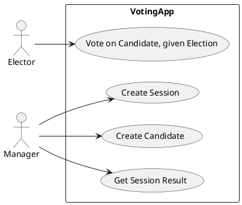

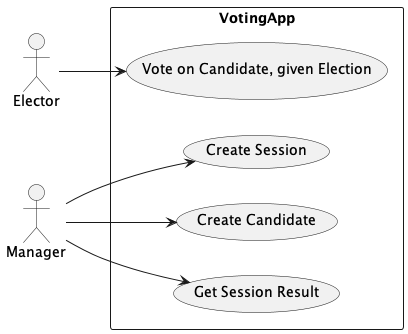

1. **Vote on a Candidate**: The primary function, allowing an Elector to cast a vote for their preferred candidate
   during an active election.

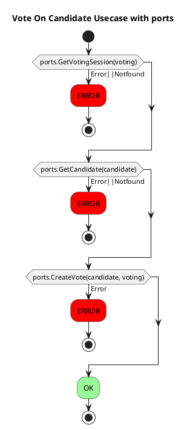

2. **Create Session**: Exclusively available for the Manager, this use case enables them to initiate a new voting
   session.

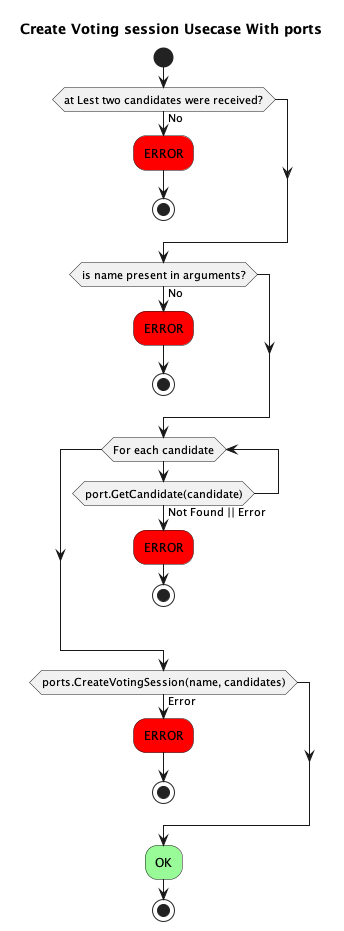

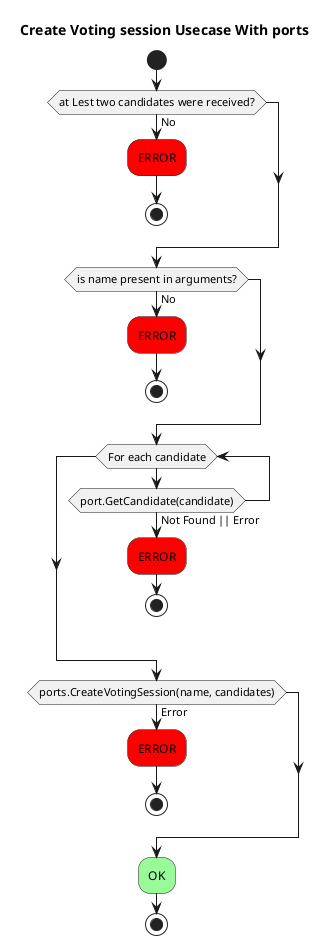

 

3. **Create Candidate**: Another Manager-specific function that lets them introduce new candidates for the upcoming or
   ongoing elections.

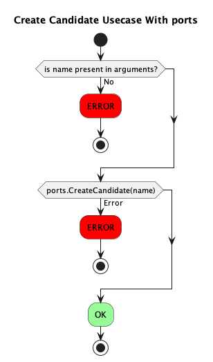

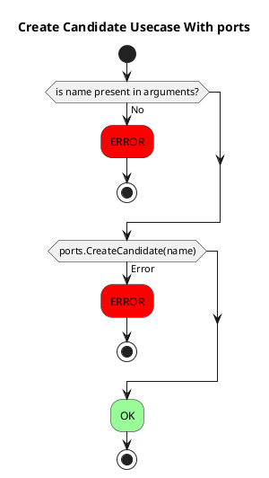

4. **Get Session Result**: Post-voting, the Manager can retrieve the results of a voting session, determining the
   candidate with the highest votes or discerning the voting trends.

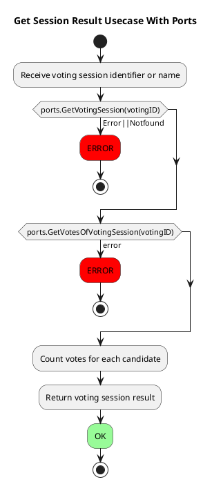

This workshop's objective is to guide you through the intricacies of designing this application using Clean Architecture
principles.
By its conclusion, you will have a solid grasp of creating well-structured, scalable, and maintainable software systems.

---

# Activities

When embarking on the journey of implementing Clean Architecture for a particular Usecase, it's vital to understand that
the essence of this endeavor lies in the foundational concepts we employ. We're embracing principles like the separation
of concerns, adhering to SOLID guidelines, employing inversion of control (IoC), establishing clear boundaries, and
ensuring that dependencies always point inwards towards the core of the architecture. These principles form the bedrock
of our approach, promoting a system that's modular, maintainable, and resilient. Those steps are one way of applying
these crucial concepts:

1. **Domain Objects Creation**:
    - Begin by asking: Do you have your domain objects defined?
    - If not, this is the perfect time to create them. Drawing from your use cases, sketch out an initial version of
      your domain models.
    - Consider the most complex use case, the one that interacts with multiple entities. Determine what resources it may
      need and design domain objects accordingly.

2. **Test Your Usecase**:
    - With your domain objects in place, draft a test for the use case. This test should:
        - Receive the use case as input.
        - Verify its behavior.
        - Highlight the expected outcome.
    - Write this test in such a way that it initially fails (this is a typical practice in test-driven development).

3. **Identify Required Ports**:
    - Reflect on the use case you're working on. What ports are essential for its functionality? Remember, ports
      represent external aspects or details of your system that aren’t crucial at this stage.
    - Declare these ports, keeping them separate from the core logic of your application.

4. **Adapter Implementation**:
    - At this point, with all preceding steps completed, you should have a code fragment that can execute its tasks once
      you inject the required port implementations (adapters).
    - Question to ponder: Do you have a specific test for this port? If not, what is the anticipated behavior of this
      port?
    - It's time to draft tests for these ports now.

5. **In-Memory Port Version**:
    - Implement an in-memory version of the required ports. This version will be pivotal for running tests without
      needing a real-world implementation.

6. **Run Tests for Usecases and Ports**:
    - Execute the tests for both the use cases and the ports.
    - Assess the outcomes. Do they align with your expectations? If they don't, identify the discrepancies. Can you
      pinpoint which parts are not producing the anticipated results?
    - Fine-tune your code until all tests pass (turn "green").

7. **PlainText Adapter Implementation**:
    - Armed with the in-memory version, attempt to create a plaintext version of the adapter. This version can be more
      practical or suited for real-world scenarios.
    - Now, there’s no need to craft new tests. Simply reuse the tests you've already developed for the ports. If your
      architecture is well-structured, these tests should validate any new implementations seamlessly.

---

# Clean Architecture Principles:

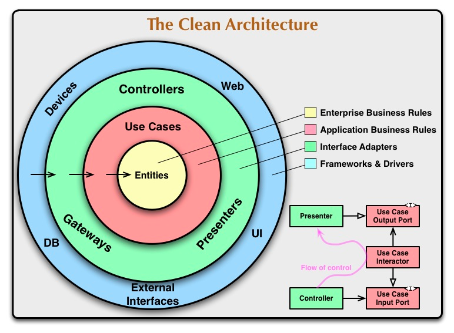

The principles of Clean Architecture guide developers to create maintainable, scalable, and testable software.
By adhering to these principles, we ensure that our software is resilient against changes and remains modular and
decoupled.

## 1. **SOLID**

SOLID is an acronym that represents a set of five design principles aimed at improving the design, structure, and
understanding of software.
They are used in exaustion in clean architecture to achieve the most flexible and maintainable form of the software

- **Single Responsibility Principle (SRP):** A class should have only one reason to change. It means a class should have
  only one responsibility or job.

- **Open/Closed Principle (OCP):** Software entities (classes, modules, functions) should be open for extension but
  closed for modification. It promotes the use of interfaces and inheritance to allow existing code to evolve without
  making major changes.

- **Liskov Substitution Principle (LSP):** Objects of a derived class should be able to replace objects of the base
  class without affecting the correctness of the program. It ensures that a subclass can stand in for its parent class
  without breaking anything.

- **Interface Segregation Principle (ISP):** Clients should not be forced to implement interfaces they don't use.
  Instead of having a large, all-encompassing interface, it's better to have smaller, more specific ones.

- **Dependency Inversion Principle (DIP):** High-level modules should not depend on low-level modules. Both should
  depend on abstractions. This principle inverts the traditional flow of dependency.

## 2. **IoC (Inversion of Control)**

Inversion of Control is a principle where the flow of an application is inverted. Instead of the application defining
its flow, external services or frameworks control it. Dependency Injection is a common technique to achieve IoC, making
software components more decoupled and testable.

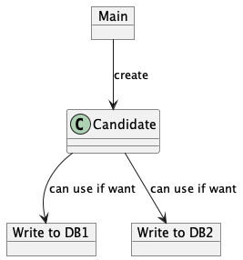

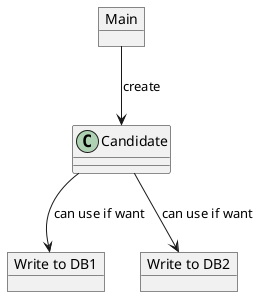

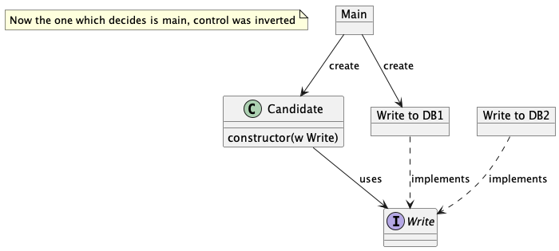

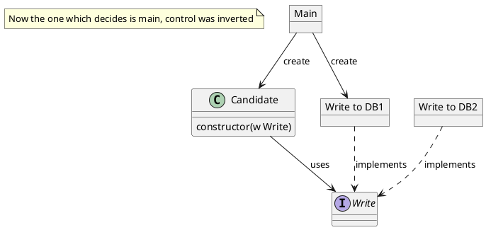

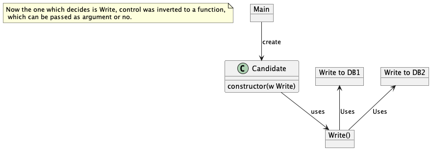

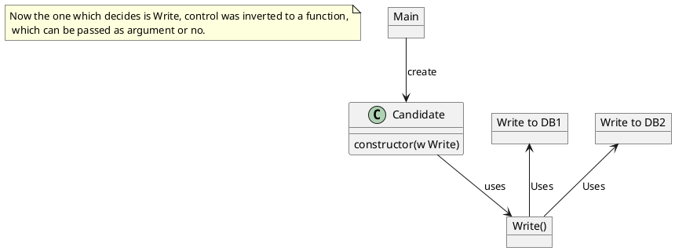

1. **Description:**
    - IoC involves inverting the flow of control, with the application relinquishing control to external services or
      frameworks. Dependency Injection (DI) is a technique to achieve IoC.

2. **PlantUML Diagrams:**
    - **First Diagram:** This diagram shows a simple scenario where the `Candidate` class has the control to decide
      which database to write to, either `Write to DB1` or `Write to DB2`. It represents a traditional flow where
      the `Candidate` class has the decision-making capability.
    - **Second Diagram:** Here, the control is inverted. The `Main` object now decides which database
      writer (`Write to DB1`) the `Candidate` class will use. By using an interface `Write`, any class that implements
      this interface can be passed to the `Candidate` class. This showcases Dependency Injection in action.
    - **Third Diagram:** The third diagram seems to indicate that the function `Write()` is the one deciding or
      controlling which specific implementation to use. This example introduces the concept of passing a function as an
      argument, which is another form of IoC.

## 3. **Boundaries**

Boundaries define clear separations between different parts of the system, such as business logic and database logic. By
setting boundaries, we ensure that changes in one part of the system do not affect other parts. It helps in achieving
separation of concerns.

## 4. **Details Do Not Matter**

In Clean Architecture, the belief is that details (like databases, frameworks, or external services) should not drive
the system design. Instead, the focus should be on the core domain logic, which represents the true business value.

## 5. **Dependencies Only Point Inwards Towards The Data**

Dependencies within the application should point inwards towards the core domain. This means that outer layers (like UI
or frameworks) should depend on inner layers (like business rules), but not the other way around.

## 6. **Onion Architecture**

Onion Architecture emphasizes the decoupling of software layers, keeping the core domain (or business logic) in the
center and free of dependencies. All other layers, such as infrastructure or UI, depend on the core domain, ensuring
that the business logic remains isolated and pure.

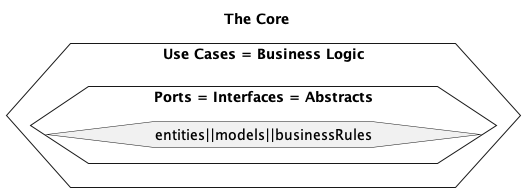

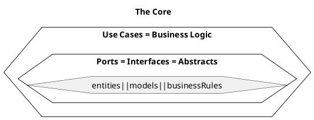

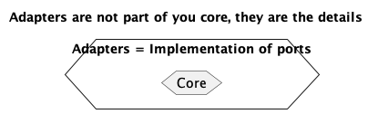

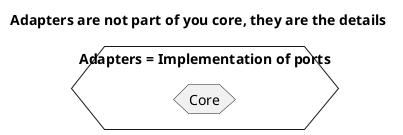

## 7. **Testability**

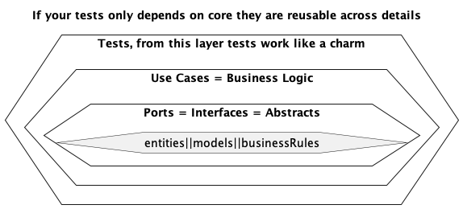

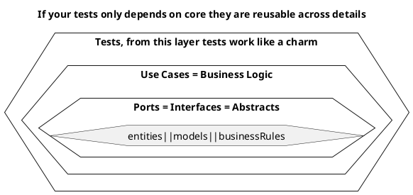

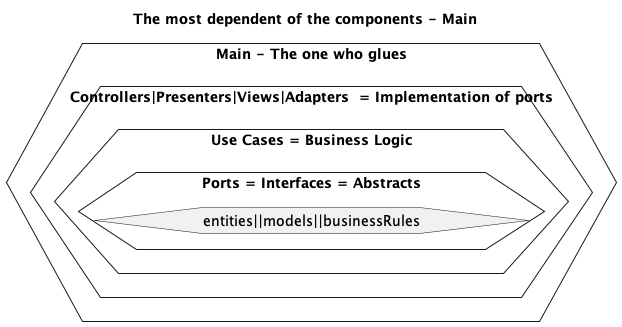

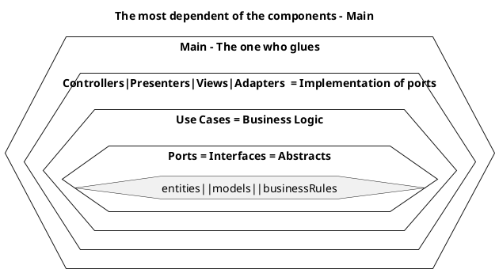

